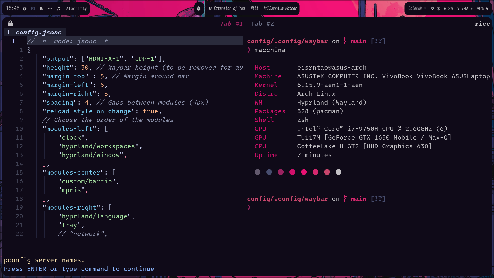
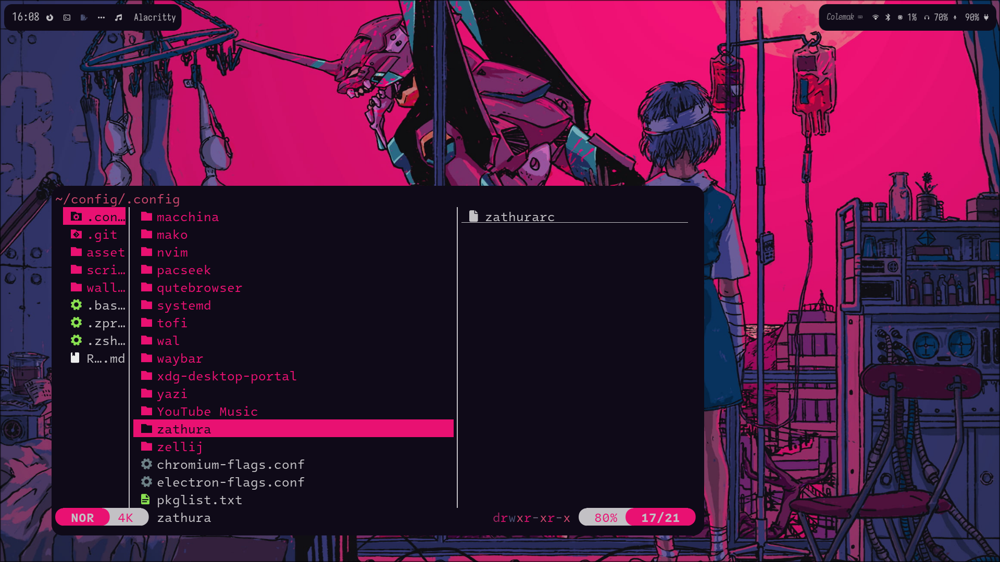
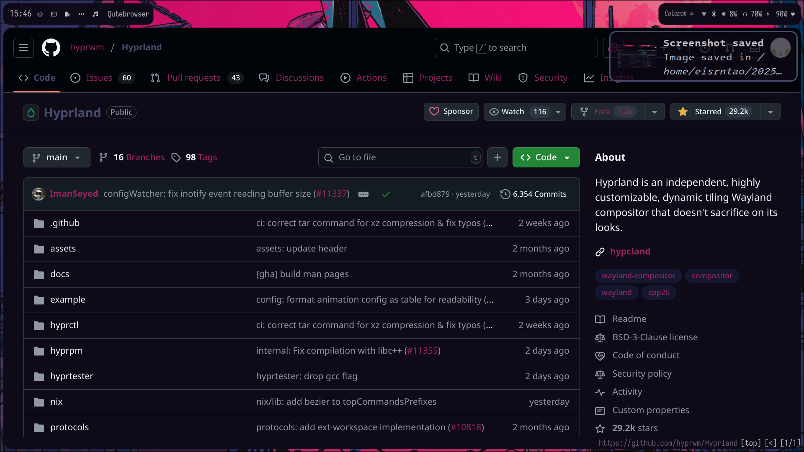
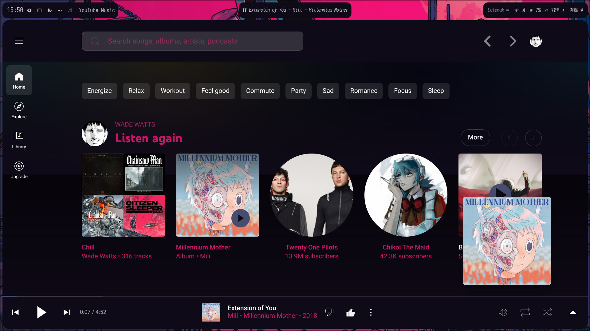
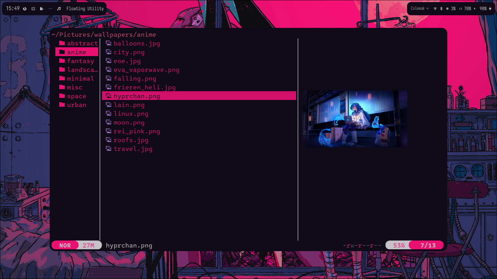
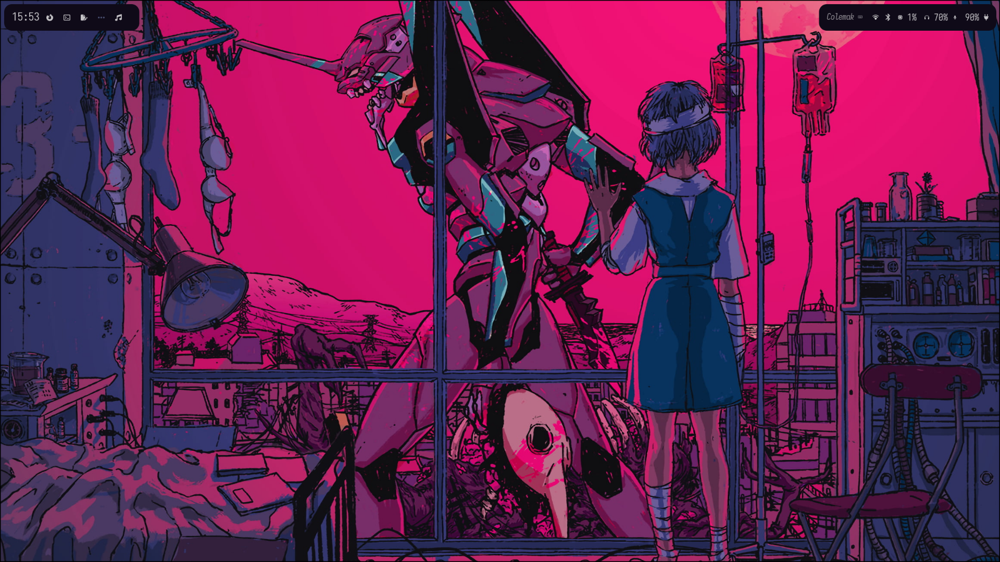
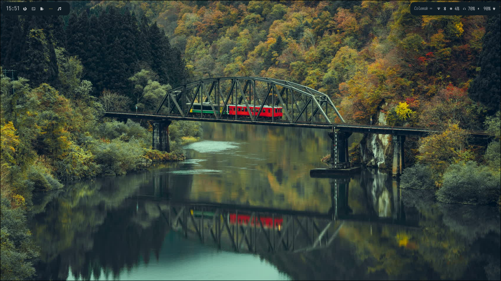
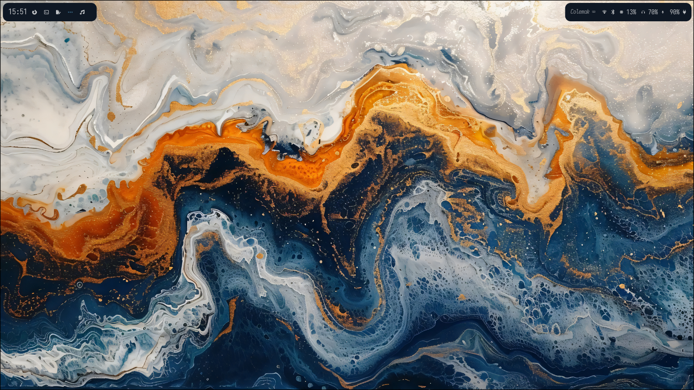
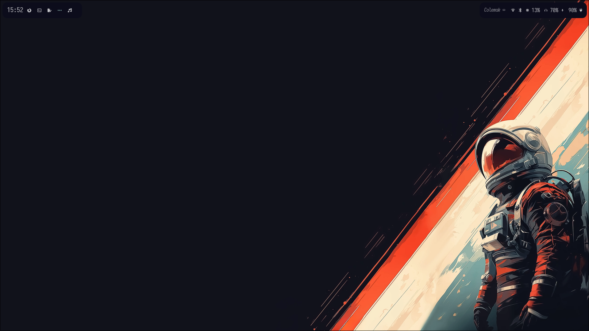

# Eisrntao's dotfiles

These are my personal dotfiles and are a constant work in progress. I use [Hyprland](https://github.com/hyprwm/Hyprland), because I like it for a lot of reasons. My terminal emulator is [Alacritty](https://github.com/alacritty/alacritty)

**Features include:**
## Colemak
I use the colemak keyboard layout, so all programs use remaps for colemak, with the exception of neovim, where I use the a keyboard nav layer.
## Themed qutebrowser

A [qutebrowser](https://github.com/qutebrowser/qutebrowser) config with colemak bindings, a very minimal style and a custom stylesheet for apps as well as using cookie injections to theme DuckDuckGo (which loads styles using JS and is therefore impossible to theme with css).

##  Kanata

Using [kanata](https://github.com/jtroo/kanata), the keyboard is remapped to have esc on caps and home row mods, but also a nav layer accessed with space which has backspace on caps, arrows in vim locations, enter on ; and the leader for zellij on ralt.

## Youtube music theme

The [music player](https://github.com/th-ch/youtube-music) has a custom theme which adapts to the rest of the system.

## Theme switching
The entire system integrates [pywal](https://github.com/eylles/pywal16) and has a custom script which uses [yazi](https://github.com/sxyazi/yazi) as a file selector to change the wallpaper and reload the colors.

*Some themes:*

